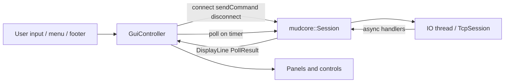

# GUI Layer

The `gui` library is a wxWidgets desktop client for Genesis MUD. It owns the main window,
panels, and dialogs. All game protocol logic lives in `mudcore`; the GUI never parses
telnet or GMCP directly.

## Thread model

Three execution contexts cooperate:

| Context | Role |
|---------|------|
| **wx main thread** | Window events, timer callbacks, painting, user input |
| **IO thread** | `boost::asio::io_context::run()` — TCP connect/read/write |
| **30 ms wx timer** | Calls `mudcore::Session::poll()` on the main thread |

`GuiController` bridges the threads:

1. User actions (connect, disconnect, submit command) post work to the IO thread via
   `Session` (or call session methods that post internally).
2. Network handlers on the IO thread enqueue display lines and phase changes into
   thread-safe session queues.
3. The wx timer drains those queues on the main thread and updates panels.

`GuiController` keeps an `executor_work_guard` on the `io_context` so `run()` does not
return while idle (without this, Connect posts never execute). Shutdown releases the
guard, stops the context, and joins the IO thread.

## Folder taxonomy

```
src/gui/
  app.cpp                 wxApp entry point
  main_frame.*            Top-level window and macro layout
  gui_controller.*        Sole owner of mudcore::Session
  connection_settings.*   wxConfig persistence for host/port
  controls/               Reusable widgets (main display, magic map, input bar)
  panels/                 Layout containers (comms, vitals, map notebook, footer)
  dialogs/                Modal UI (connect, error, settings)
  menu/                   Application menu bar
```

`MainClientFrame` owns the sizer layout only. Child panels expose accessors; the controller
routes data to them.

## GuiController as sole Session owner

`GuiController` constructs `mudcore::Session` with a private `io_context` and is the only
GUI type that calls `connect()`, `disconnect()`, `sendCommand()`, or `poll()`. Panels are
passive views: they receive `append()`, `refresh()`, or `clear()` from the controller.

Connection phase drives UX:

- **Input bar** enabled during `HandshakeSent` and `Ready`.
- **Menu bar** enables Connect only when `Disconnected`; Disconnect when connected but not
  `Connecting`.
- **System Log tab** auto-selected on phase changes and network errors.
- **Input focus** moves to the input bar when phase reaches `Ready`.
- **Displays cleared** when phase returns to `Disconnected` (not on connect).

## Data flow



### Display routing

`Session::poll()` returns `DisplayLine` values tagged with an `OutputSink`:

| Sink | Panel |
|------|-------|
| `Main` | `MainDisplay` |
| `Comms` | `CommsPanel` |
| `System` | `SystemLogPanel` (notebook tab) |

`GameState` updates (vitals, room map) arrive via `PollResult::stateChanged`. The controller
refreshes `VitalsBarPanel` and `MagicMapPanel` (room short description label; zoom map
preferred over full map when available).

### Settings persistence

Default host and port (`mud.genesismud.org` / `3011`) are stored in `wxConfig` under app
name `GenesisMUD`. `ConnectDialog` and `SettingsDialog` load and save the same keys.

## Layout

```
┌─────────────────────────────────────────────────────────────┐
│ Menu bar                                                    │
├──────────────────────────────┬──────────────────────────────┤
│ Main display                 │ Comms                        │
│                              ├──────────────────────────────┤
│                              │ Notebook: MAGIC MAP | SYSTEM │
├──────────────────────────────┴──────────────────────────────┤
│ Input bar                                                   │
│ Vitals bars (health / mana / stamina)                       │
│ Connection footer (phase, connect / disconnect / settings)    │
└─────────────────────────────────────────────────────────────┘
```

## Dialogs

| Dialog | Purpose |
|--------|---------|
| `ConnectDialog` | Host/port entry; persists on OK |
| `SettingsDialog` | Edit default host/port; optional debug logging |
| `ErrorDialog` | Debounced modal for network errors |

## Live testing

Enable **Debug logging** in Settings to mirror GMCP package names (truncated bodies) and
connection phase transitions to the System Log tab. Use this for the first live sessions
against `mud.genesismud.org:3011`.

Manual smoke checklist (execute in order; stop and fix on failure):

1. Connect with saved defaults — phase reaches `Handshake Sent`; System Log tab selected
2. Observe login banner in main display — readable text; prompts not broken by extra newlines
3. Enter name and password via input bar — commands accepted during `Handshake Sent`
4. Wait for `Char.Login` — phase `Ready`; input focused
5. Send `look` — main output updates; room label and map populate
6. Send a comm command (e.g. `say hi`) — comms panel updates
7. Move to an adjacent room — room label/map/vitals refresh; exits not duplicated
8. Disconnect — panes cleared; Connect re-enabled
9. Reconnect and re-login — full flow without app restart

## Building and testing

The GUI target links `mudcore` and wxWidgets. Unit tests live in `mudcore` and `network`;
the GUI is verified by build success and manual smoke testing after changes.
